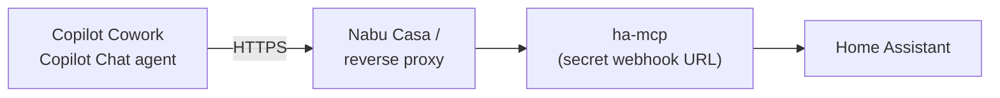

<p align="center">
  
</p>

<h1 align="center">Home Assistant for Microsoft 365 Copilot</h1>

<p align="center">
  Connect <a href="https://github.com/homeassistant-ai/ha-mcp">ha-mcp</a> to <b>Copilot Cowork</b> and <b>Copilot Chat</b> with one app package.
</p>

---

## Quick setup: Microsoft 365 Copilot

**Recommended for Microsoft 365 users.** One package gives you two experiences:

| Surface | What you get | Tools |
|---|---|---|
| **Copilot Cowork** | Home Assistant as a connector for Cowork tasks | All ha-mcp tools, discovered live |
| **Copilot Chat** | A **Home Assistant** agent in the agents pane | A pinned, focused set (configurable) |

1. Run ha-mcp with a **remote HTTPS webhook URL** ([step 1](#1-how-is-your-mcp-server-running) and [step 3](#3-local-or-remote-access)).
2. Put that URL in `config.json` and run `.\build.ps1` ([step 4](#4-configure-and-build)).
3. Upload `ha-mcp-plugin.zip` in Cowork, and install it for Copilot Chat ([step 5](#5-install)).

---

## 1. How is your MCP server running?

Any ha-mcp install method works, as long as it can be reached over HTTPS from the internet (see [step 3](#3-local-or-remote-access)). Microsoft 365 Copilot runs in Microsoft's cloud, so a local address never works.

| Method | Notes | |
|---|---|---|
| ⭐ **HA Custom Component** | Recommended. Runs inside Home Assistant, every install type, built-in webhook URL | [Set up](https://homeassistant-ai.github.io/ha-mcp/setup/?method=ha-component) |
| **HA app (add-on)** | Home Assistant OS / Supervised only | [Set up](https://homeassistant-ai.github.io/ha-mcp/setup/) |
| **Docker** | Container, needs your own HTTPS exposure | [Set up](https://homeassistant-ai.github.io/ha-mcp/setup/) |
| **uvx (Python)** | HTTP server via Python, needs your own HTTPS exposure | [Set up](https://homeassistant-ai.github.io/ha-mcp/setup/) |
| ~~Local stdio~~ | Not supported for Microsoft 365 Copilot (no remote access) | |

With the **HA Custom Component**, open the integration's **Configure** screen and copy the **webhook URL for remote clients**:

```
https://<your-ha-domain>/api/webhook/<webhook-id>
```

---

## 2. Requirements

The following is required to make this plugin work:

- A Microsoft 365 account with access to **Copilot Cowork** and/or **Copilot Chat** with agents
- For the Chat agent: A Microsoft 365 Copilot license, since agent actions don't run without one
- **PowerShell 7** on Windows (the build script refuses Windows PowerShell 5.1, whose `Compress-Archive` can write invalid zip paths)

---

## 3. Local or remote access?

**Microsoft 365 Copilot requires remote access.** Connectors need Streamable HTTP over HTTPS (TLS 1.2+).



> **Read-only start:** append `/readonly` to the webhook URL to expose only read operations while you test.

---

## 4. Configure and build

### 4.1 Project layout

```
ha-mcp-plugin\
├── build.ps1             build script (requires PowerShell 7)
├── update-tools.ps1      optional: refresh the tool list from your server
├── config.json           webhook URL, version, Chat tool list  (never commit)
├── config.example.json   example config.json file, with a dummy URL
├── .gitignore
└── src\
    ├── manifest.json           uses {{VERSION}} and {{HA_WEBHOOK_URL}}
    ├── declarativeAgent.json   Copilot Chat agent: instructions, starters
    ├── ha-mcp-plugin.json      Plugin manifest for the Copilot Chat agent's action
    ├── color.png               192×192 color icon
    ├── outline.png             32×32 outline icon
    └── tools\
        └── ha-chat-tools.json     focused set of tools of your ha-mcp server
        └── ha-cowork-tools.json   tools/list dump of your ha-mcp server
```

`ha-mcp-plugin.json` and `tools/ha-chat-tools.json` are **generated** by the build. Don't create them in `src`.

### 4.2 Configure

Copy `config.example.json` to `config.json` and fill it in:

```json
{
  "webhookUrl": "https://<your-ha-domain>/api/webhook/<webhook-id>",
  "version": "1.0.0",
  "chatTools": [
    "ha_get_overview",
    "ha_search",
    "ha_get_state",
    "ha_get_history",
    "ha_call_service"
  ]
}
```

| Field | Purpose |
|---|---|
| `webhookUrl` | The only place the URL lives. Injected into both the Cowork connector and the Chat agent |
| `version` | App version (`x.y.z`). **Raise it on every build**, or Microsoft 365 won't pick up the change |
| `chatTools` | Tools available to the Copilot Chat agent. Keep it to about 10 for reliable tool selection |

### 4.3 (Optional) Refresh the tool list

The repository ships `src/tools/ha-cowork-tools.json`, a tool list from a recent ha-mcp version, so you can build right away.

- **Cowork** ignores its content and discovers tools live from your server.
- **Copilot Chat** pins the schemas of your `chatTools` from this file, so they must match your ha-mcp version.

Refresh it from your own server when:

- your ha-mcp version differs from the one the shipped file came from,
- the build reports *chatTools not found*,
- the Chat agent's tool calls fail after an ha-mcp update.

```powershell
Unblock-File .\update-tools.ps1   # once, after downloading
.\update-tools.ps1
```

The script reads `webhookUrl` from `config.json`, fetches the tool list from your server, keeps a backup (`ha-cowork-tools.json.bak`), and reports which tools were added or removed. It warns if a tool in `chatTools` no longer exists.

### 4.4 Build

```powershell
Unblock-File .\build.ps1   # once, after downloading
.\build.ps1
```

The build validates the URL format, the version, the tool names and all JSON, then writes `ha-mcp-plugin.zip` with every file at the root of the archive.

---

## 5. Install

**Cowork → Customize → Plugins → upload** `ha-mcp-plugin.zip`, and publish it for yourself.

After a few minutes, **Home Assistant** appears in the Copilot Chat agents pane.

---

## 6. Verify

**Cowork:** ask something like *"How many lights are on?"*. Cowork discovers all ha-mcp tools live.

**Copilot Chat:** open the Home Assistant agent in a **new** chat and:

1. Send `-developer on` as a separate message
2. Ask *"How many lights are on?"*
3. Check the **Agent debug info** card:
   - **Agent version** matches `version` in `config.json`
   - Under **Actions**, every tool from `chatTools` shows **Matched**, and the right one shows **Selected**

Send `-developer off` or start a new chat to leave developer mode.

---

## 7. Updating

1. Edit files in `src\` or `config.json` (never in `build\`, which is overwritten)
2. Raise `version` in `config.json`
3. Run `.\build.ps1`
4. Upload in Cowork and reinstall for Copilot Chat, then test in a **new** chat

---

## Troubleshooting

| Symptom | Cause | Fix |
|---|---|---|
| Upload fails: *Required properties are missing: `mcpToolDescription`* | Cowork's validator requires it, although Cowork discovers tools live | Keep `src/tools/ha-cowork-tools.json` ([4.3](#43-dump-your-servers-tool-list)) |
| Home Assistant shows up in Copilot Chat only as a **data source** | Chat doesn't expose `agentConnectors` as tools, or the package was only installed via Cowork | Install via Agents Toolkit or Teams ([step 5](#copilot-chat)) and use the **agent** |
| Chat agent says it has no Home Assistant tools | Dynamic discovery (`"functions": []`) doesn't work for this setup in Chat | The build pins `chatTools`. Check the debug card for **Matched** functions |
| Build: *chatTools not found in ha-cowork-tools.json* | Tool renamed in your ha-mcp version | Refresh the dump ([4.3](#43-dump-your-servers-tool-list)) or fix the name in `config.json` |
| Build: *webhookUrl must look like...* | Placeholder or malformed URL | Use the full `https://.../api/webhook/<id>` URL |
| Changes don't appear | Version not raised, or old conversation | Raise `version`, reinstall, start a new chat |
| Cowork shows versions like 3.0.0 | Cowork's own upload counter | Cosmetic. The debug card shows the real app version |
| Upload fails on file structure | Zip contains a folder instead of files at the root | Always build with `build.ps1` |

---

## Security

- This setup uses **authorization type `None`**: the **webhook URL is the only credential** for your Home Assistant. Treat it like a password.
- `config.json`, `build\` and `*.zip` contain the URL. They're in `.gitignore`. Never commit or share them.
- **Regenerate the webhook ID** in ha-mcp if the URL may have leaked (chats, screenshots, shared zips), then update `config.json`, raise the version and rebuild.
- Consider a **read-only URL** (`/readonly`) or a Chat tool set without `ha_call_service` if you only need to read data.
- The Chat agent is instructed to ask for confirmation before changing automations, scripts, dashboards or configuration.

---

## Credits

Built on [ha-mcp](https://github.com/homeassistant-ai/ha-mcp) by homeassistant-ai. Package and build tooling by Danny de Vries.
